# 🔐 Kali Linux Cybersecurity Lab — VirtualBox NAT Network Setup

<div align="center">

**Building an isolated virtual environment for cybersecurity learning, network configuration, and ethical security testing**

</div>

<p align="center">


</p>

---

## 📌 Project Overview

This project documents the setup and configuration of a **Kali Linux cybersecurity laboratory** using **Oracle VM VirtualBox**.

The main purpose of the lab is to create a controlled virtual networking environment where Kali Linux can be configured, tested, restored, and later used for authorized cybersecurity and penetration-testing exercises.

During the setup, a dedicated **VirtualBox NAT Network** was created using the `10.0.0.0/24` IPv4 network. Kali Linux was then connected to this virtual network and configured with a manual IPv4 address.

The initial static configuration used `10.0.0.2`, which resulted in a connectivity problem and `Destination Host Unreachable` messages during testing. The configuration was subsequently changed to `10.0.0.4`, after which the network configuration was verified.

Finally, a VirtualBox snapshot named **`mykali`** was created to preserve the configured state of the virtual machine.

---

## 🎯 Objectives

The main objectives of this project are to:

* Install and configure Oracle VM VirtualBox.
* Import and configure Kali Linux 2026.2.
* Create a dedicated **NAT Network** in VirtualBox.
* Configure the Kali VM to use the NAT Network.
* Understand the difference between standard **NAT** and **NAT Network**.
* Configure a manual IPv4 address inside Kali Linux.
* Configure subnet mask, gateway, and DNS settings.
* Verify the network interface using Linux commands.
* Test communication with the virtual gateway and external network.
* Troubleshoot an IPv4 connectivity problem.
* Change the static IP configuration to resolve the issue.
* Create a clean VirtualBox snapshot after successful configuration.
* Prepare the environment for future cybersecurity experiments.

---

## 🛡️ Purpose of the Lab

The laboratory provides a controlled environment for learning and practicing cybersecurity concepts without directly experimenting on unauthorized systems.

The environment can later be expanded by adding additional virtual machines to the same virtual network.

Possible future activities include:

* Network reconnaissance
* Network discovery
* Port scanning
* Vulnerability assessment
* Packet analysis
* Web security testing
* Security-tool experimentation
* Linux networking practice
* Client/server communication
* Controlled penetration-testing exercises

⚠️ **Important:** All security testing must be performed only against systems that you own or have explicit permission to test.

---

## 🏗️ Lab Architecture

The initial laboratory consists of:

```text
                    ┌─────────────────────────┐
                    │       Host Computer     │
                    │        Windows 10       │
                    └────────────┬────────────┘
                                 │
                                 │ VirtualBox
                                 │
                    ┌────────────▼────────────┐
                    │       NatNetwork        │
                    │      10.0.0.0/24        │
                    │                         │
                    │ Gateway: 10.0.0.1       │
                    └────────────┬────────────┘
                                 │
                         ┌───────▼───────┐
                         │   Kali Linux  │
                         │    2026.2     │
                         │               │
                         │ Final IP:     │
                         │ 10.0.0.4/24   │
                         └───────────────┘
```

The network is designed so that additional virtual machines can be connected to the same NAT Network in future cybersecurity exercises.


# ⚙️ Lab Configuration

| 🧩 Component         | ⚙️ Configuration         |
| -------------------- | ------------------------ |
| 🖥️ Host OS          | Windows 11               |
| 🧰 Hypervisor        | Oracle VM VirtualBox 7.2 |
| 🐉 Security OS       | Kali Linux 2026.2        |
| 🧠 Kali RAM          | 2048 MB                  |
| ⚡ Kali CPU           | 2 Processors             |
| 🌐 Virtual Network   | NAT Network              |
| 📡 Network Name      | `NatNetwork`             |
| 🔢 Network Address   | `10.0.0.0/24`            |
| 🚪 Gateway           | `10.0.0.1`               |
| ❌ Initial Static IP  | `10.0.0.2`               |
| ✅ Final Static IP    | `10.0.0.4`               |
| 🌍 DNS               | `8.8.8.8`                |
| 🐧 Network Interface | `eth0`                   |
| 📸 Snapshot          | `mykali`                 |

---

# 🪜 Lab Setup Procedure

## Step 1. Install 7-Zip

7-Zip was installed to extract the Kali Linux virtual machine package.

Kali Linux VirtualBox images may be distributed in compressed archive formats, so an archive utility is required to extract the downloaded files.

**Tool:** 7-Zip

---

## Step 2. Install Oracle VM VirtualBox

Oracle VM VirtualBox was installed as the virtualization platform used to create and manage the cybersecurity laboratory.

VirtualBox provides the virtual machine hardware, networking, storage, snapshots, and other virtualization features required for this project.

---

## Step 3. Create the NAT Network

A dedicated NAT Network was created in VirtualBox for the cybersecurity laboratory.

The network was configured with:

```text
Network Name: NatNetwork
IPv4 Prefix:  10.0.0.0/24
DHCP:         Enabled
IPv6:         Disabled
```

The `/24` prefix provides the network:

```text
Network:    10.0.0.0
Mask:       255.255.255.0
```

This allows multiple virtual machines to be placed within the same private virtual network.

### 📷 Screenshot — NAT Network Configuration


```markdown
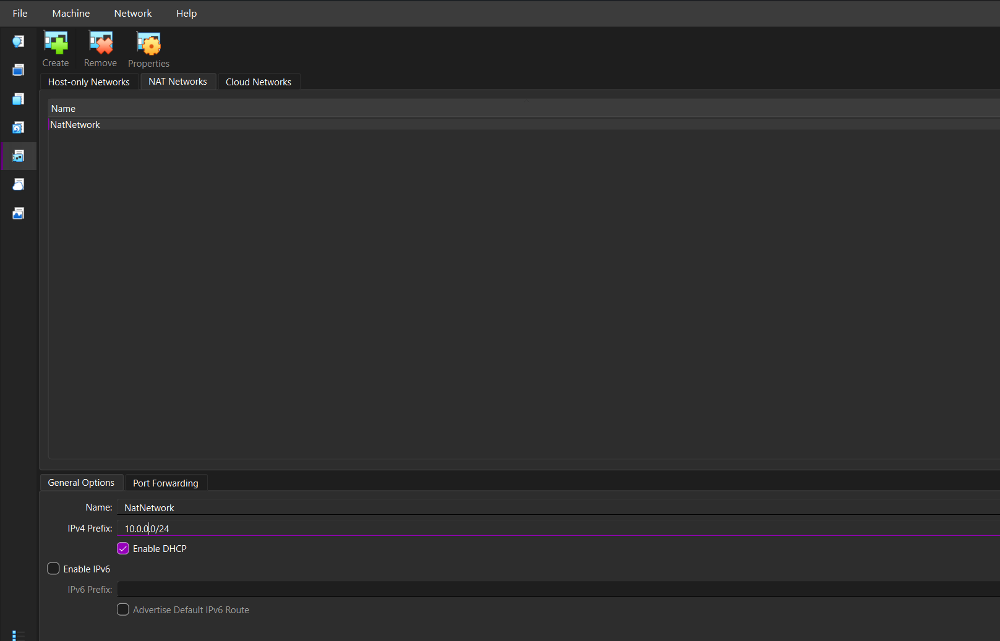
```

---

## Step 4. Import Kali Linux

The Kali Linux 2026.2 VirtualBox appliance was imported into VirtualBox.

The imported virtual machine was configured with:

```text
Operating System: Kali Linux 2026.2
RAM:              2048 MB
Processors:       2
```

The VM was then prepared for network configuration.

### 📷 Screenshot — Kali Linux Virtual Machine


```markdown
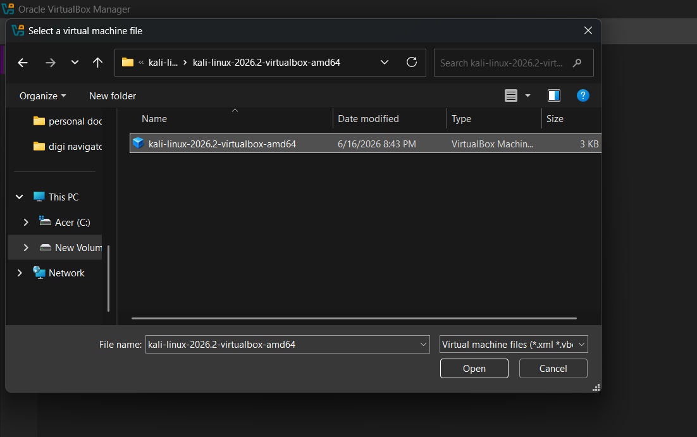
```

```markdown
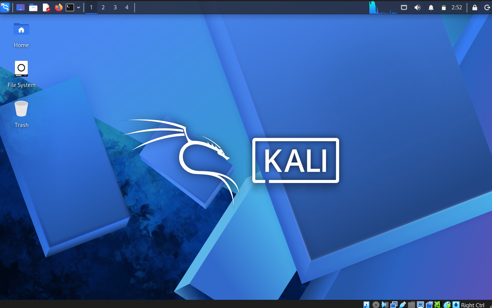
```

---

## Step 5. Configure the VirtualBox Network Adapter

Initially, the Kali Linux virtual machine was using the standard **NAT** networking mode.

The adapter was then changed to:

```text
Adapter:       Adapter 1
Attached to:   NAT Network
Name:          NatNetwork
```

This connects the VM to the custom NAT Network created earlier.

### NAT vs NAT Network

A standard **NAT** configuration primarily provides outbound connectivity for an individual VM.

A **NAT Network** allows multiple VMs connected to the same NAT Network to communicate with one another while also providing NAT-based external connectivity.

This makes NAT Network useful for building a multi-machine cybersecurity laboratory.


```markdown
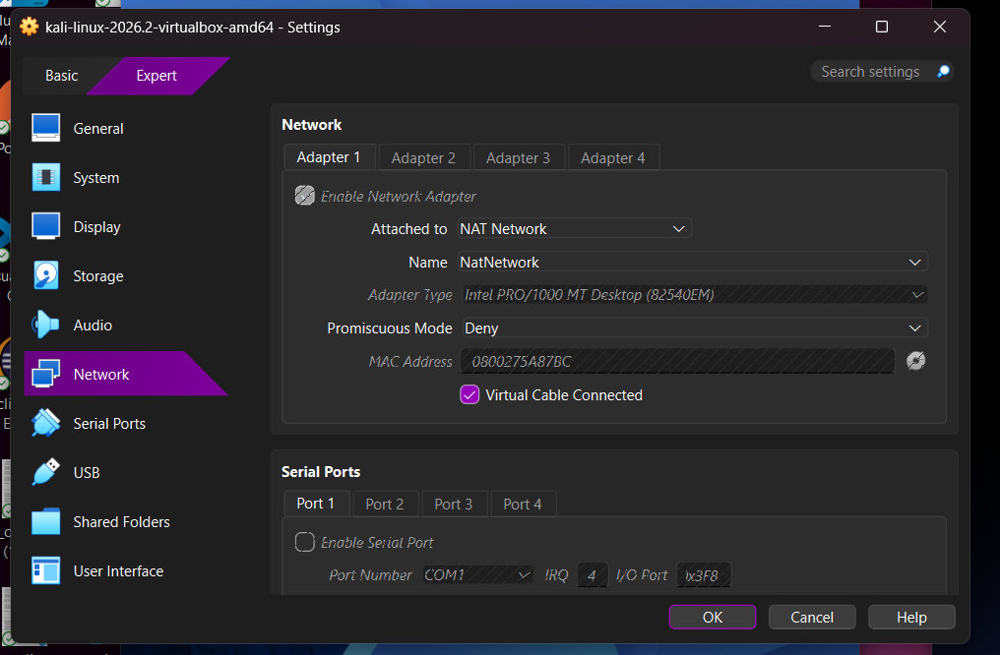
```

---

# 🌐 Kali Linux Network Configuration

## Step 6. Open NetworkManager

After starting Kali Linux, the network configuration was managed through **NetworkManager**.

The connection profile used was:

```text
Wired connection 1
```

The Ethernet interface was identified as:

```text
eth0
```

The IPv4 configuration was then opened for manual configuration.

### 📷 Screenshot — Ethernet Configuration

> **Insert your Ethernet settings screenshot here.**

```markdown
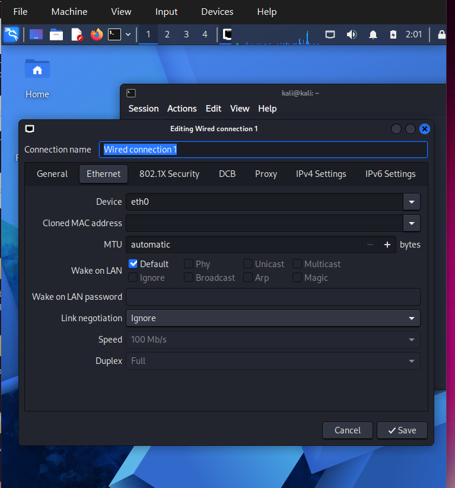
```

---

## Step 7. Configure Manual IPv4

The IPv4 method was changed from automatic configuration to **Manual**.

The initial configuration used:

```text
Address:     10.0.0.2
Netmask:     24
Gateway:     10.0.0.1
DNS:         8.8.8.8
```

The corresponding subnet mask is:

```text
255.255.255.0
```

### 📷 Screenshot — Manual IPv4 Configuration


```markdown
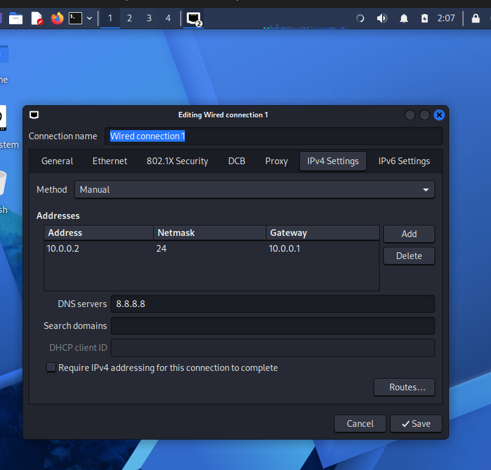
```

---

# 🔎 Network Interface Verification

## Step 8. Restart the Network Interface

After modifying the network configuration, the interface was restarted.

```bash
sudo ifconfig eth0 down
sudo ifconfig eth0 up
```

The interface configuration was then checked using:

```bash
ip a show eth0
```

The interface showed the configured IPv4 address:

```text
10.0.0.2/24
```

at this stage of the experiment.

### 📷 Screenshot — `ip a`


```markdown
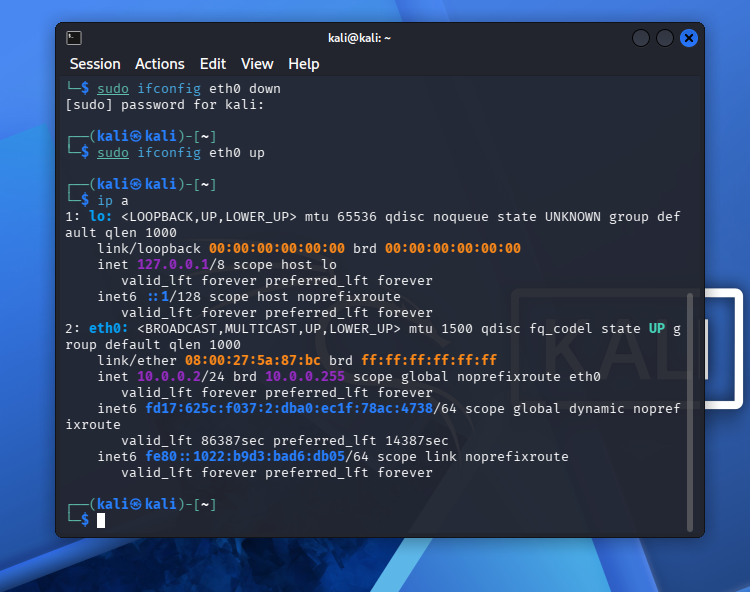
```

---

# 📡 Connectivity Testing

## Step 9. Test External Connectivity

The external network connection was tested using Google's public DNS server:

```bash
ping 8.8.8.8
```

However, the initial configuration did not successfully reach the external destination.

The terminal returned messages similar to:

```text
From 10.0.0.2 icmp_seq=1 Destination Host Unreachable
From 10.0.0.2 icmp_seq=2 Destination Host Unreachable
```

This indicated that although the interface had an IPv4 address, packets were not successfully reaching the intended destination.


```markdown
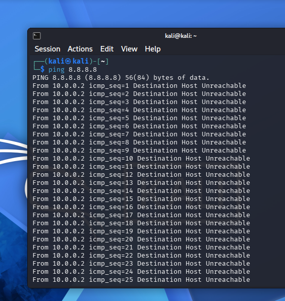
```

---

# 🐞 Problems Encountered & Troubleshooting

## Problem 1. `Destination Host Unreachable`

### 🛑 Problem

The first manual configuration assigned:

```text
Kali IP: 10.0.0.2/24
Gateway: 10.0.0.1
```

The interface appeared to have the expected IPv4 address, but connectivity testing failed.

The following command:

```bash
ping 8.8.8.8
```

returned:

```text
Destination Host Unreachable
```

### 🔍 Investigation

The important observation was that the Linux interface itself was configured with:

```text
10.0.0.2/24
```

but packets were not successfully reaching the gateway or external destination.

This demonstrated an important networking concept:

> **Having an IP address assigned to an interface does not automatically mean that the host has working network connectivity.**

The subnet, gateway, routing, ARP resolution, and virtual network configuration must all work together.

### 💡 Resolution

The static address was changed from:

```text
10.0.0.2
```

to:

```text
10.0.0.4
```

while keeping the same network:

```text
Network: 10.0.0.0/24
Gateway: 10.0.0.1
DNS:     8.8.8.8
```

The network interface was restarted and the configuration was verified again.

The final configuration became:

```text
IP Address: 10.0.0.4/24
Gateway:    10.0.0.1
DNS:        8.8.8.8
```

This resolved the configuration problem observed during the initial setup.


```markdown
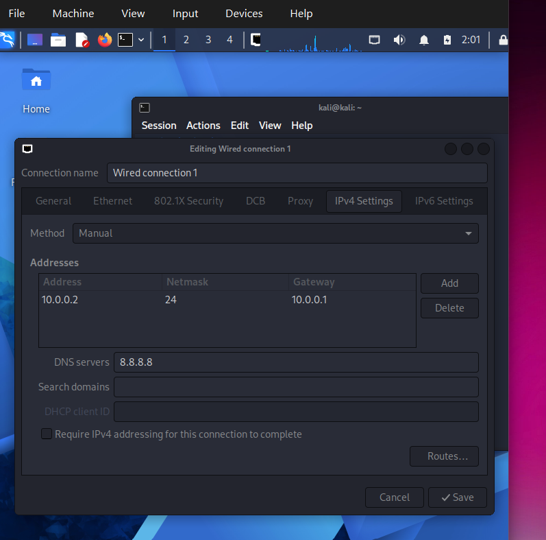
```


```markdown
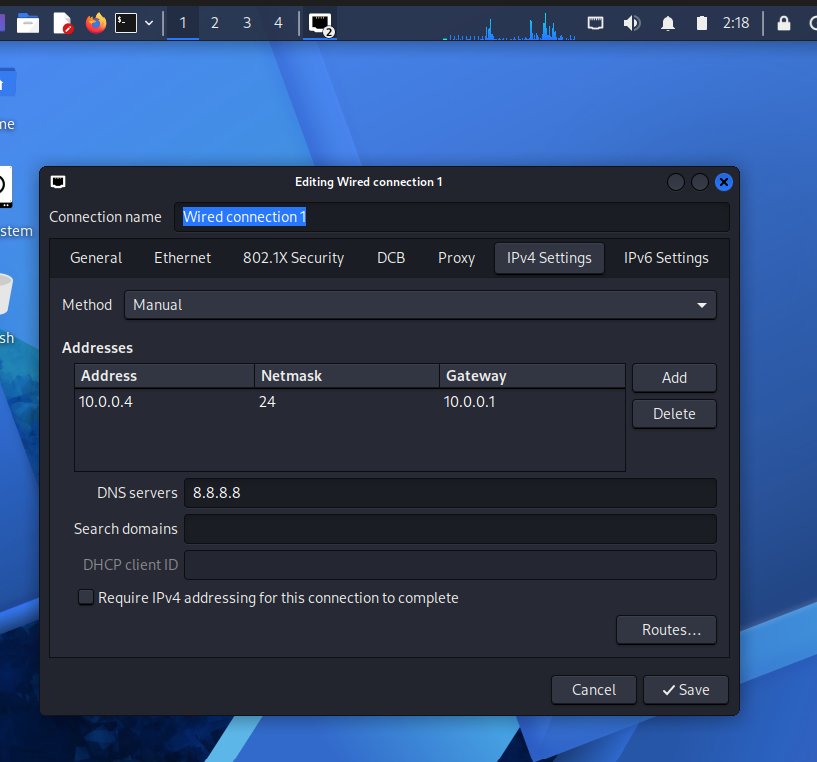
```

---

# ✅ Final Network Configuration

After troubleshooting, the Kali Linux VM was configured with:

```text
Network Name:  NatNetwork
Network:       10.0.0.0/24
Kali IP:       10.0.0.4/24
Subnet Mask:   255.255.255.0
Gateway:       10.0.0.1
DNS:           8.8.8.8
Interface:     eth0
```

The final configuration was then used as the baseline for the virtual machine.

---

# 📸 Verification

The following commands can be used to verify the final configuration.

### Check IP Address

```bash
ip a
```

### Check Interface

```bash
ip a show eth0
```

### Check Routing Table

```bash
ip route
```

### Test Gateway

```bash
ping -c 4 10.0.0.1
```

### Test Internet Connectivity

```bash
ping -c 4 8.8.8.8
```

### Test DNS Resolution

```bash
nslookup google.com
```

A successful configuration should show the expected `10.0.0.4/24` address and an appropriate default route through `10.0.0.1`.

---

# 📸 VirtualBox Snapshot

## Step 10. Create a Clean Snapshot

After completing the network configuration, a VirtualBox snapshot was created.

The purpose of the snapshot is to preserve a known-good state of the Kali Linux VM.

If a future cybersecurity experiment changes the system configuration or causes an unexpected problem, the VM can be restored to this baseline.

The snapshot was named:

```text
mykali
```

### Snapshot Procedure

1. Shut down the Kali Linux VM cleanly.
2. Open VirtualBox Manager.
3. Select the Kali Linux VM.
4. Open the **Snapshots** section.
5. Select the current machine state.
6. Choose **Take Snapshot**.
7. Enter:

```text
mykali
```

8. Confirm the snapshot.


```markdown
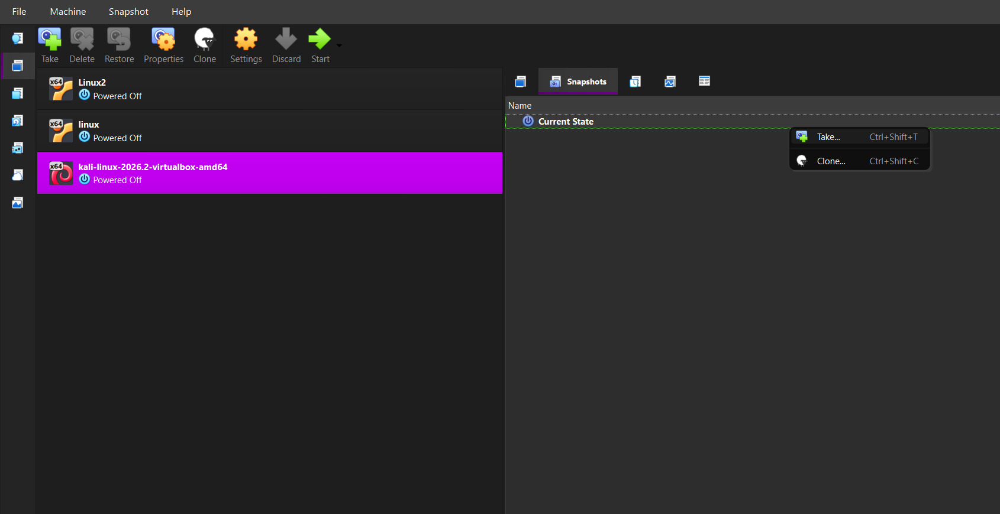
```

### 📷 Screenshot — Completed Snapshot


```markdown
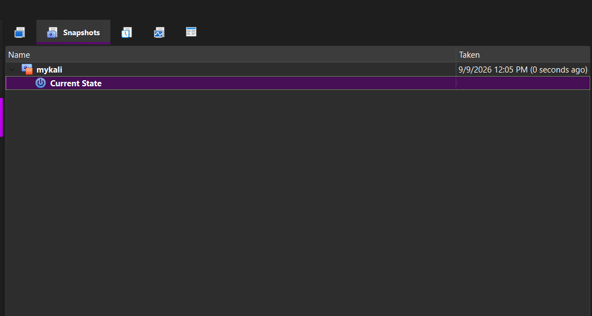
```

---

# 📊 Final Lab Configuration

| Parameter             | Final Configuration      |
| --------------------- | ------------------------ |
| **Host OS**           | Windows 10               |
| **Hypervisor**        | Oracle VM VirtualBox 7.2 |
| **Security OS**       | Kali Linux 2026.2        |
| **RAM**               | 2048 MB                  |
| **Processors**        | 2                        |
| **Virtual Network**   | NAT Network              |
| **Network Name**      | `NatNetwork`             |
| **IPv4 Network**      | `10.0.0.0/24`            |
| **Subnet Mask**       | `255.255.255.0`          |
| **Gateway**           | `10.0.0.1`               |
| **Initial Kali IP**   | `10.0.0.2`               |
| **Final Kali IP**     | `10.0.0.4`               |
| **DNS**               | `8.8.8.8`                |
| **Network Interface** | `eth0`                   |
| **Snapshot**          | `mykali`                 |

---

# 💡 What I Learned

## 1. NAT and NAT Network

I learned that standard NAT and NAT Network are different VirtualBox networking modes.

NAT is useful for providing a VM with outbound connectivity, while NAT Network is useful when multiple virtual machines need to communicate within the same virtual network.

---

## 2. IPv4 Addressing

I learned how an IPv4 address works together with a subnet mask, gateway, and DNS configuration.

For example:

```text
IP Address:  10.0.0.4
Subnet:      /24
Mask:        255.255.255.0
Gateway:     10.0.0.1
```

---

## 3. Static IP Configuration

I learned how to manually configure an IPv4 address using Kali Linux NetworkManager instead of relying completely on DHCP.

Static addressing can make a laboratory environment easier to document and reference when multiple VMs are used.

---

## 4. Network Troubleshooting

One of the most important lessons from this project was that an interface showing an IP address does not necessarily mean that network connectivity is working.

The initial configuration demonstrated how a host can have:

```text
10.0.0.2/24
```

while still receiving:

```text
Destination Host Unreachable
```

Troubleshooting therefore requires checking the interface, address, subnet, gateway, routing, ARP behavior, and virtual network configuration.

---

## 5. VirtualBox Networking

I learned how VirtualBox connects a virtual machine's virtual network adapter to different network types.

This provides a foundation for creating more complex cybersecurity laboratories containing:

```text
Kali Linux
      │
      ├── Target VM
      ├── Web Server
      ├── Vulnerable Machine
      └── Other Lab Systems
```

---

## 6. VM Snapshots

I learned the importance of creating a clean snapshot before performing risky or experimental cybersecurity activities.

The `mykali` snapshot provides a recovery point that can be used to restore the VM to its configured baseline.

---

## 7. Documentation

This project also helped me understand the importance of documenting:

* Configuration settings
* Commands
* Screenshots
* Problems
* Troubleshooting steps
* Final results
* Lessons learned

Good documentation makes technical work easier to reproduce, troubleshoot, and present professionally.

---

# 🔐 Security & Ethical Use

This laboratory is intended strictly for **education, cybersecurity learning, and authorized security testing**.

The virtual environment should only be used against:

* Systems owned by the user
* Intentionally vulnerable lab machines
* CTF environments
* Systems for which explicit testing permission has been obtained

Do not use penetration-testing tools against unauthorized systems.

The purpose of this project is to provide a safe and controlled environment for developing cybersecurity and networking skills.

---

# 🔮 Future Improvements

The laboratory can be expanded in future projects by adding additional virtual machines.

Possible future architecture:

```text
                    NAT Network
                   10.0.0.0/24
                         │
        ┌────────────────┼────────────────┐
        │                │                │
        ▼                ▼                ▼
   Kali Linux        Target VM       Web Server
  10.0.0.4          10.0.0.x         10.0.0.x
   Attacker           Lab Target       Testing
```

Future experiments may include:

* Network discovery
* Nmap scanning
* Packet capture with Wireshark
* Vulnerability assessment
* Web application security testing
* Linux server hardening
* Firewall configuration
* Client/server networking
* Controlled exploitation
* Security monitoring
* Building an attacker/target virtual lab

---

# 🧰 Tools & Technologies

| Tool                     | Purpose                                   |
| ------------------------ | ----------------------------------------- |
| **Oracle VM VirtualBox** | Virtualization and VM management          |
| **Kali Linux**           | Cybersecurity testing environment         |
| **7-Zip**                | Extracting VM archives                    |
| **NetworkManager**       | Linux network configuration               |
| **ifconfig**             | Interface management                      |
| **ip**                   | Network configuration and verification    |
| **ping**                 | Connectivity testing                      |
| **nslookup**             | DNS testing                               |
| **GitHub**               | Project documentation and version control |

---

# 🔗 Tools & Resources

* **Oracle VM VirtualBox** — Virtualization platform
* **Kali Linux** — Penetration-testing and cybersecurity distribution
* **7-Zip** — Archive extraction utility

---

# 📁 Repository Structure

Recommended repository organization:

```text
cybersecurity-kali-virtualbox-lab/
│
├── README.md
│
├── screenshots/
│   ├── 01-nat-network.png
│   ├── 02-kali-vm.png
│   ├── 03-initial-nat.png
│   ├── 04-nat-network-adapter.png
│   ├── 05-ethernet-settings.png
│   ├── 06-manual-ipv4.png
│   ├── 07-ip-a.png
│   ├── 08-connectivity-failure.png
│   ├── 09-ip-10.0.0.2.png
│   ├── 10-destination-host-unreachable.png
│   ├── 11-ip-10.0.0.4.png
│   ├── 12-create-snapshot.png
│   └── 13-mykali-snapshot.png
│
└── docs/
    ├── part-1-network-setup.md
    └── part-2-resolution-snapshot.md
```

---

# 👤 Author

**Anil**

Computer Engineering Graduate
Cybersecurity & Networking Lab Project

---

# 📌 Project Information

**Project:** Kali Linux Cybersecurity Lab Setup
**Module:** Virtualization & Networking
**Platform:** Oracle VM VirtualBox
**Security OS:** Kali Linux 2026.2
**Network:** `10.0.0.0/24` NAT Network
**Final Kali IP:** `10.0.0.4/24`
**Snapshot:** `mykali`

---

## ⭐ Conclusion

This project successfully established the foundation of a controlled cybersecurity laboratory using Kali Linux and Oracle VM VirtualBox.

The lab covered the complete process from creating a dedicated NAT Network and connecting Kali Linux to the network, through manual IPv4 configuration and troubleshooting, to creating a reusable VM snapshot.

The initial `10.0.0.2` configuration produced a routing/connectivity failure, providing a practical troubleshooting experience. The address was subsequently changed to `10.0.0.4`, and the final configuration was preserved using the `mykali` snapshot.

This environment can now serve as a baseline for future networking, penetration-testing, vulnerability-assessment, and cybersecurity learning projects.
